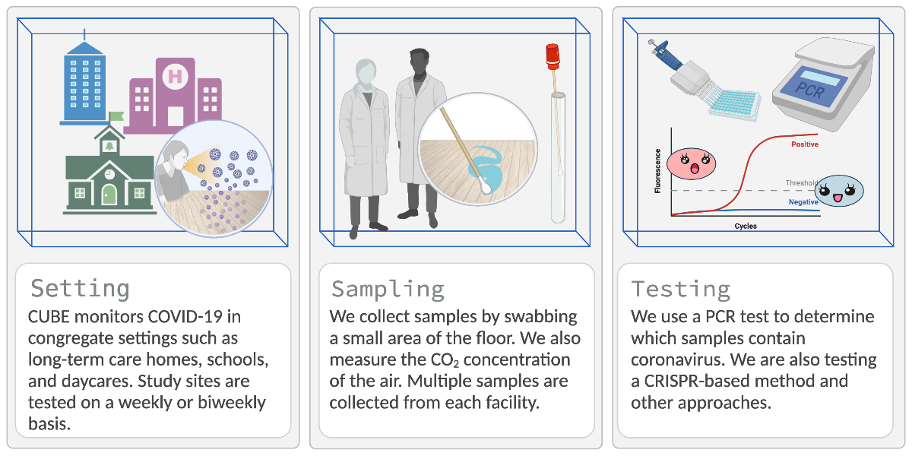

```{r setup, include=F}
set.seed(124)
knitr::opts_chunk$set(
  message = FALSE, 
  warning = FALSE, 
  echo = FALSE,
  comment = "#>",
  collapse = TRUE
)
```

```{r libs}
library(dplyr)
library(leaflet)
```

```{r Map}
# read site geo data and set marker colors based on type of site
sites <- 
  readr::read_tsv(file = 'data/sites.tsv')  |> 
  dplyr::mutate(
    color = dplyr::case_when(
      type == 'LTC' ~ 'cadetblue',
      type == 'University' ~ 'purple',
      type == 'Daycare' ~ 'green',
      type == 'School' ~ 'orange',
      TRUE ~ 'red'
    ))

# values to output in map description text
n_site <- sites |> nrow()
n_ltc <- sites |> 
  dplyr::filter(type == "LTC") |> 
  nrow()
n_dc <- sites |> 
  dplyr::filter(type %in% c('School','Daycare')) |> 
  nrow()
n_uni <- sites |> 
  dplyr::filter(type == 'University') |>
  nrow()

n_uni <- glue::glue(
  "{n_uni} {ifelse(n_uni >1, 'universities', 'university')}"
  )

# Possible values are "red", "darkred", "lightred", "orange", "beige", "green", "darkgreen", "lightgreen", "blue", "darkblue", "lightblue", "purple", "darkpurple", "pink", "cadetblue", "white", "gray", "lightgray", "black"

# define Marker style: white cube logo on coloured background
icons <- leaflet::awesomeIcons(
  icon = 'cube',
  library = 'ion',
  iconColor = 'white',
  spin = F,
  markerColor = sites$color
)

# set zoom level for locking map
zmlvl <- 5

ontario_map <-
  # leaflet map; size on page
  leaflet::leaflet(
    width = '95%', 
    height = 325, 
    padding = '1rem', 
    options = leafletOptions(zoomControl = TRUE)
  ) |>
  # set the zoom to ~province level
  setView(lng = -80, lat = 45, zoom = zmlvl)  |>
  # add the grey-shaded map tiles from cartoDB
  addProviderTiles(
    provider = providers$CartoDB.Positron, 
    # disable the zoom controls
    options = providerTileOptions(
      zoomControl = TRUE,
      maxZoom = zmlvl + 1, 
      minZoom = zmlvl - 2)
  ) |>
  # add the custom cube markers we defined above
  addAwesomeMarkers(
    data = sites,
    lng = ~ lon,
    lat = ~ lat,
    icon = icons,
    label = ~type,
    popup = NULL,
    clusterOptions = markerClusterOptions(freezeAtZoom = zmlvl)
  )
```

::: {id="#about-page"}

------------------------------------------------------------------------

::: {style="font-size: 2rem; color: #888"}
## Overview 
:::

{#infographic .img-responsive .img-fluid .rounded}

-   The Coronavirus in the Urban Built Environment (CUBE) project seeks to develop environmental sampling as a spatially-resolved method for monitoring COVID-19 in congregate settings such as long-term care homes (LTC), universities, public schools, and day-cares.\
-   We collect samples by swabbing floors; then, the swabs are tested for COVID-19 using an [RT-qPCR](https://en.wikipedia.org/wiki/Reverse_transcription_polymerase_chain_reaction) assay developed by [DNA Genotek](https://www.dnagenotek.com/) and/or a novel CRISPR-based device.\
-   Currently, we are focused on facilities located in Toronto, Ottawa, and Sault Ste. Marie.


------------------------------------------------------------------------

::: {style="font-size: 2rem; color: #888"}
## Study Locations
:::

Our research team is currently monitoring `r n_site` buildings in Toronto, Ottawa, and Sault Ste. Marie, including `r n_ltc` long-term care homes, `r n_dc` schools and day-cares, and 6 university buildings.

*Click any city to expand*

::: {style="margin: auto; display: flex; align: center;"}
```{r show map, message=F, warning=F, echo=F, fig.height=3, fig.width=3, fig.align='center'}
# display the map
ontario_map
```
:::


<!-- ends map container -->

------------------------------------------------------------------------

<!-- FAQs card -->
::: {style="font-size: 2rem; color: #888"}
## Frequently Asked Questions
:::

*Click an FAQ to reveal the answer.*

```{r faqs, results='asis'}
readr::read_tsv('data/FAQs.tsv') |> 
  bs4cards::cards(
    border_colour = '#11afd0',
    title = question,
    text = answer,
    breakpoint = 5,
    label_colour = '#f9fefe',
      
    border_width = 1,
    border_radius = 3
    )
```

<br>

:::