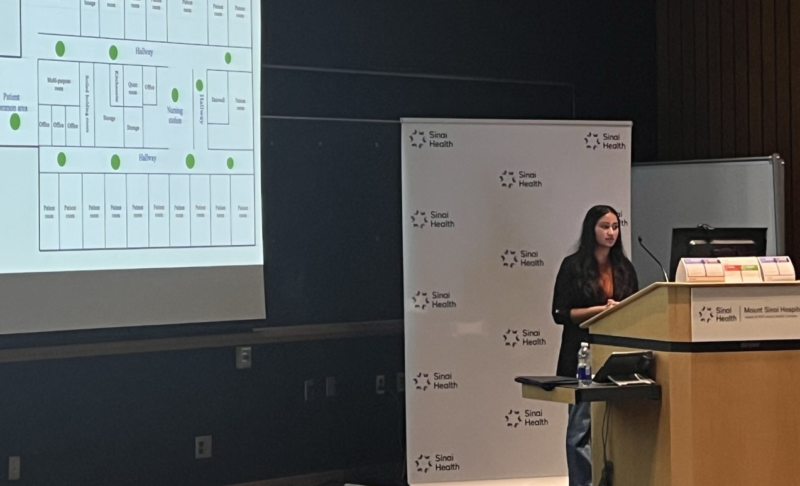
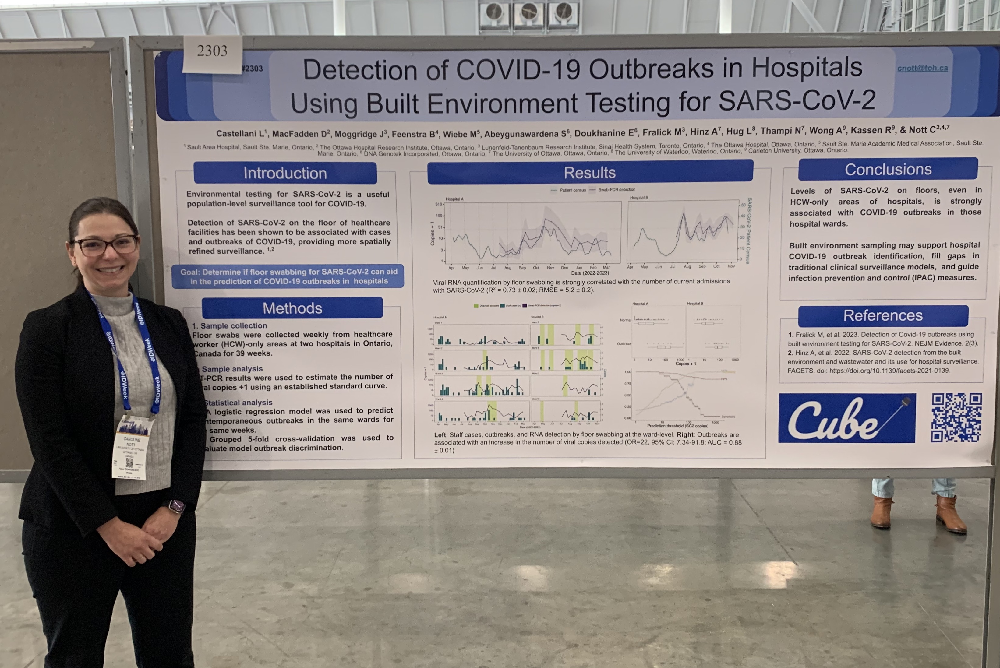
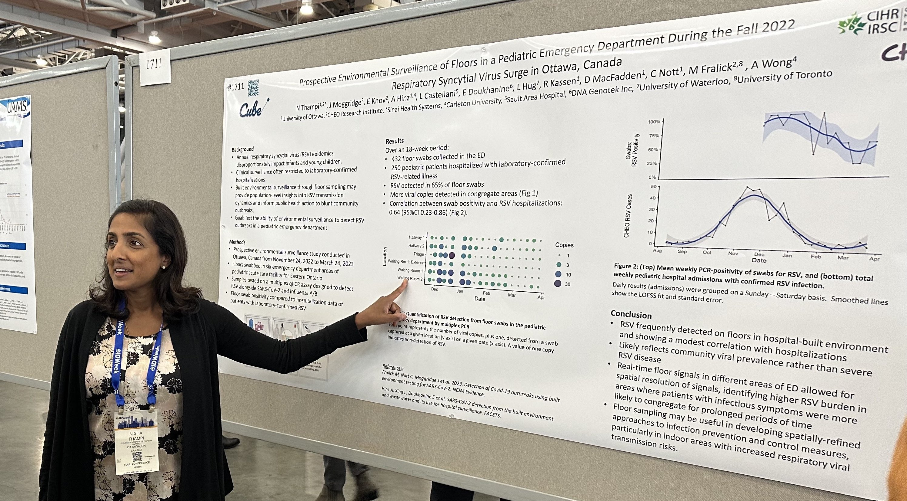
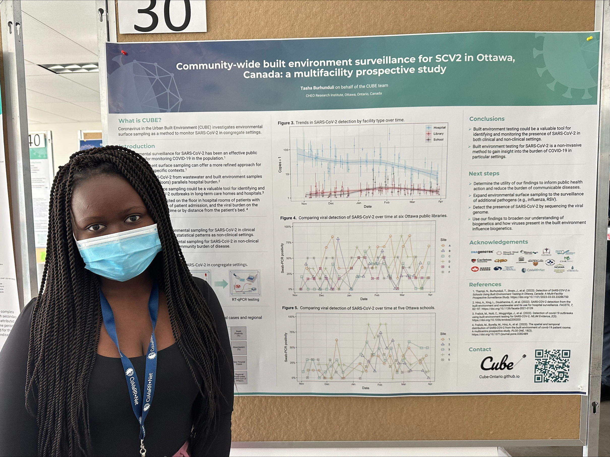
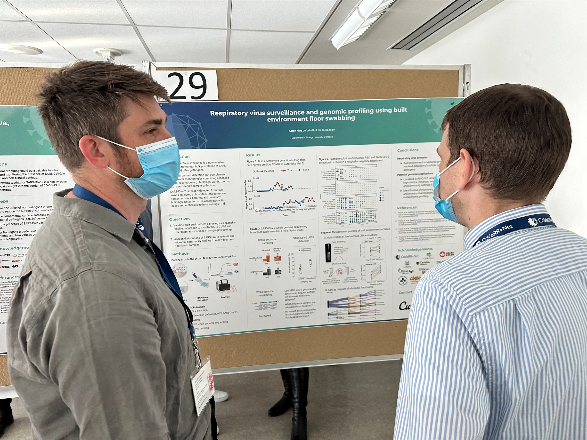
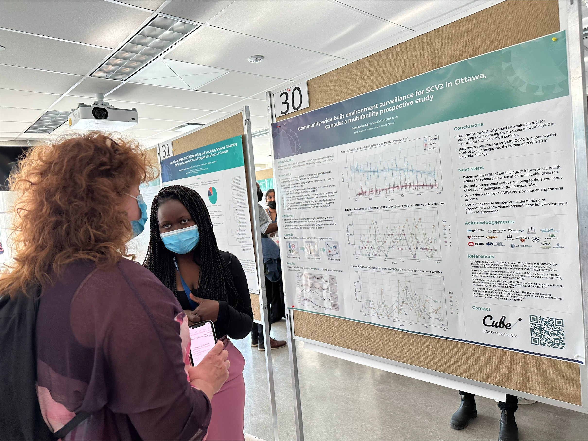

-----

### Sinai Health Quality and Safety Symposium

*October 18th, 2023. Toronto, ON.*


```{r, out.width = "650px", echo=FALSE, fig.align='center'}

```

CUBE researcher Prachi Ray (M.Sc. candidate) brought home the 🏆 Top Abstract Award (Innovation Track) 🏆 for her work "Environmental surveillance for SARS-CoV-2 for outbreak detection in hospital: A single centre prospective study". Congratulations Prachi! 


-----

### IDWeek 2023 Conference

*[October 10-14th, 2023. Boston, Mass.](https://idweek.org/)*



<br/>



<br/>

----


### CoVaRR-Net Spring 2023 Meeting 

*May 16-18, 2023. Ottawa, ON.*

<br/>



<br/>



<br/>



<br/>

------------------------------------