<!-- <!--  Follow this template for adding new events --> 
<!-- ---- -->
<!-- ### event -->
<!-- *month day<sup>th</sup>, year. Place, city, prov.* -->
<!-- sentence(s) to describe presenter, talk, event. -->

<!-- ```{r, out.width = "650px", echo=FALSE, fig.align='center'} -->
<!-- 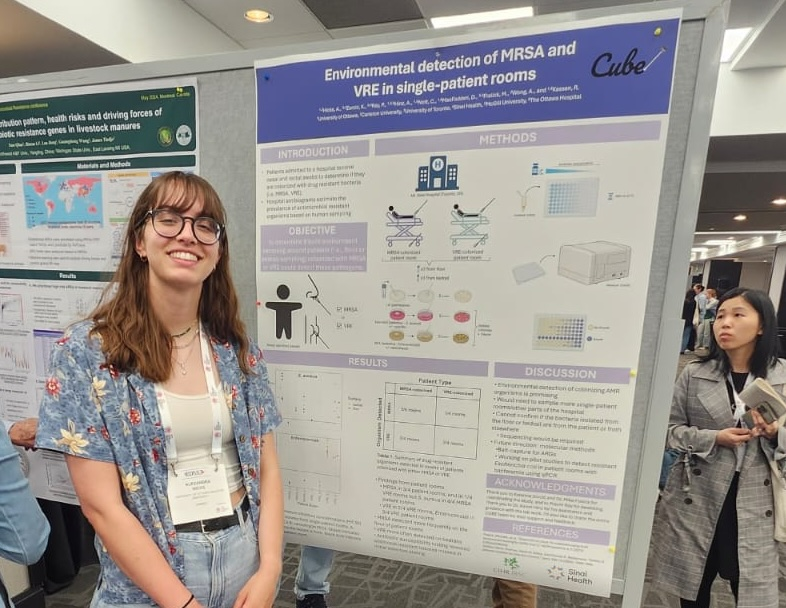 -->
<!-- ``` -->


----

### APIC Conference 2026

*June 15-17<sup>th</sup>, 2026. Nashville, TN.*

```{r, out.width = "650px", echo=FALSE, fig.align='center'}
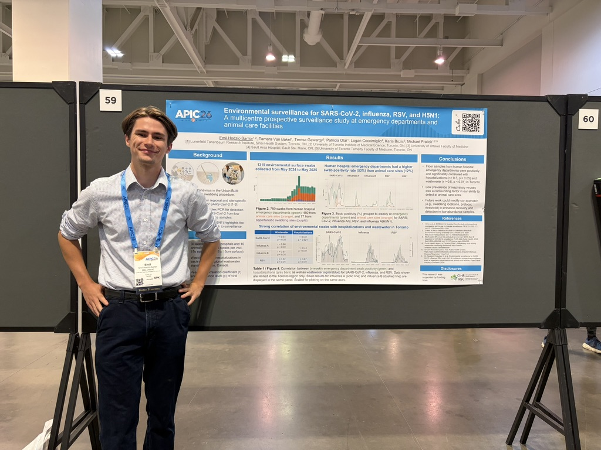
```

Emil Hodzic-Santor presenting the poster "Environmental surveillance for SARS-CoV2, influenza, RSV, and H5N1: A multicentre prospective surveillance study at emergency departments and animal care facilities" at the annual Association for Professionals in Infection Control and Epidemiology (APIC) meeting.
		
----

### CSM Conference 2025

*June 17-20<sup>th</sup>, 2025. Université de Montréal, Montreal, QC.*

Nashira Ridgeway presenting her poster "Spatially and temporally resolved monitoring of microbial communities in hospital intensive care units: Insights into colonization and antimicrobial resistance" at CSM 2025.

```{r, out.width = "650px", echo=FALSE, fig.align='center'}
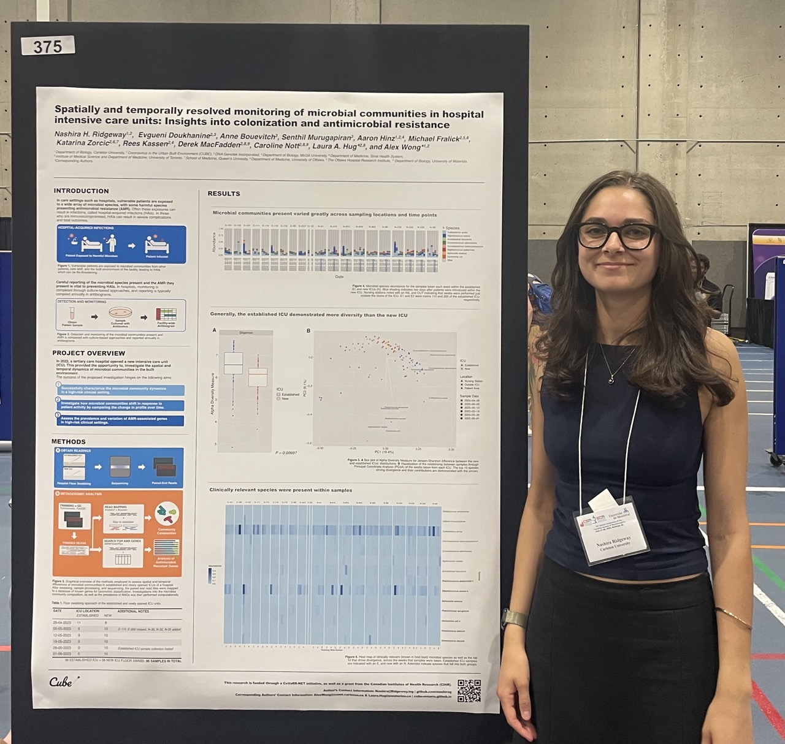
```

Aaron Hinz and Sarah Clarke presenting their poster “Surveillance of viral and bacterial pathogens using built environment swabbing" at CSM 2025.

```{r, out.width = "650px", echo=FALSE, fig.align='center'}
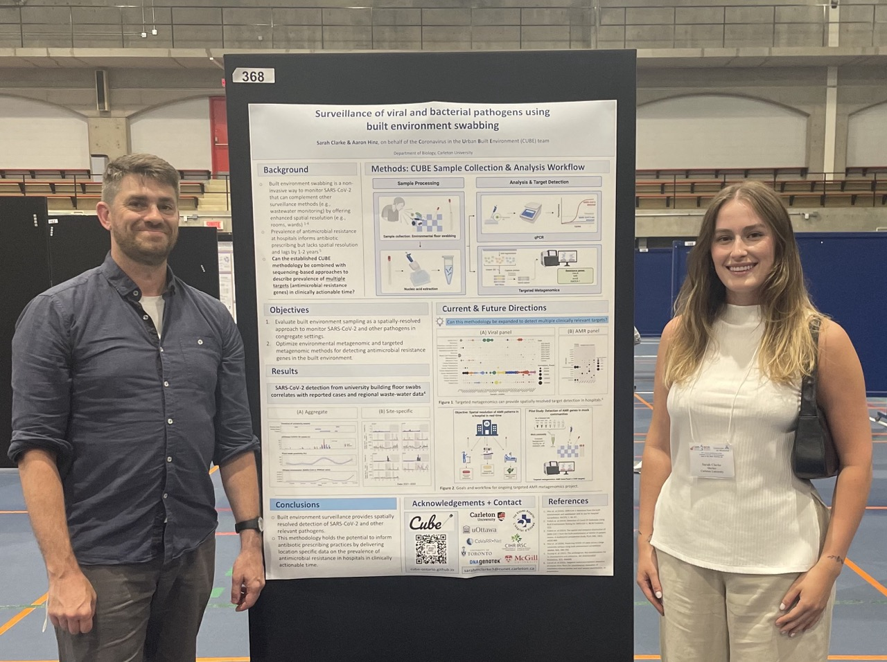
```

----

### AMR Symposium 2024

*November 19-20<sup>th</sup>, 2024. Toronto, ON.*

Drs. Caroline Nott and Derek MacFadden present “Antimicrobial Resistance and the Built Environment” at the 2024 AMR Symposium.

```{r, out.width = "650px", echo=FALSE, fig.align='center'}
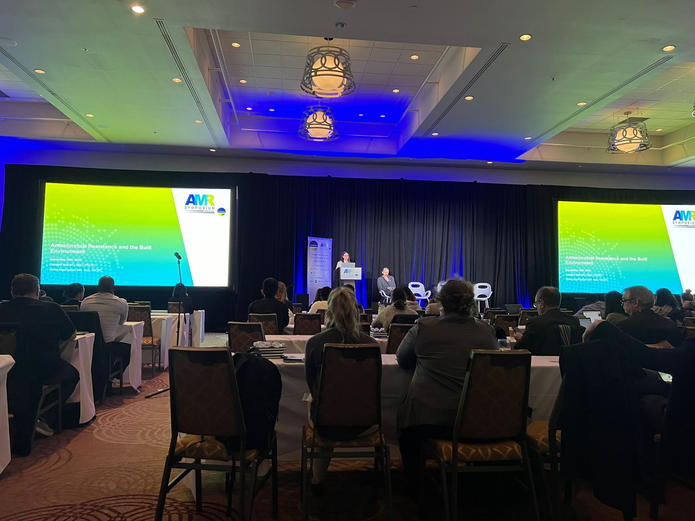
```

----

### EDAR7 Conference 2024

*May 26<sup>th</sup>-31<sup>st</sup>, 2024. McGill University, Montreal, QC.*

Alex Hicks presenting her poster "Environmental Detection of MRSA and VRE in Single-Patient Rooms" at the Environmental Dimension of Antimicrobial Resistance (EDAR7) conference.

```{r, out.width = "650px", echo=FALSE, fig.align='center'}

```

```{r, out.width = "650px", echo=FALSE, fig.align='center'}
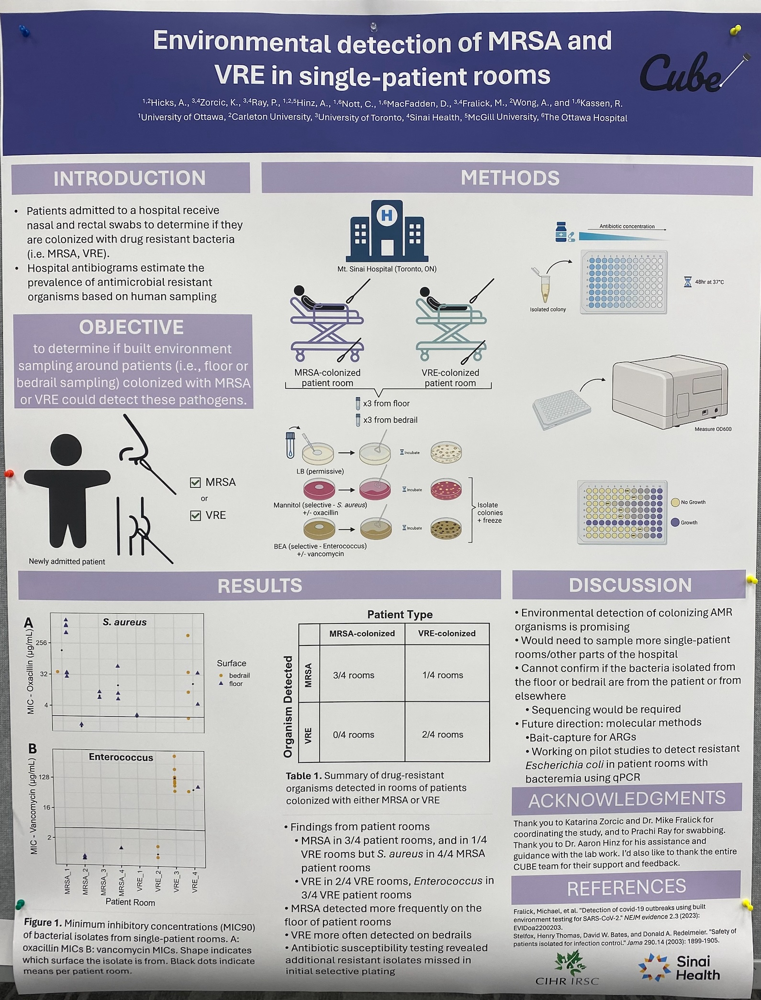
```


----

### GIM Research Day 2024

*April 17<sup>th</sup>, 2024. University of Toronto, Division of General Internal Medicine*

CUBE researcher Prachi Ray presented her poster "Environmental surveillance of SARS-CoV-2 for COVID-19 outbreak detection in hospital: A single centre prospective study".

<div style="margin: auto; width: 100%;">
[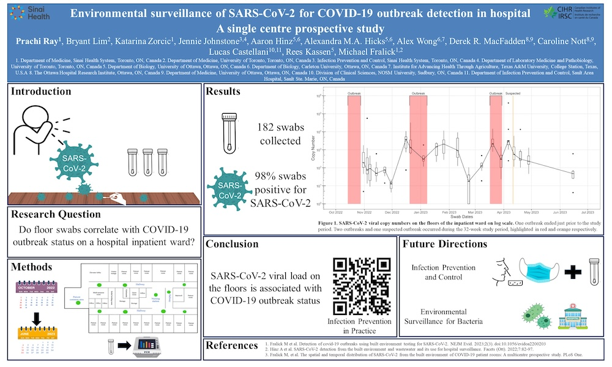](public/img/event/msh_poster_large.jpg)  
*Click image to enlarge*
</div>
-----

### Sinai Health Quality and Safety Symposium

*October 18<sup>th</sup>, 2023. Toronto, ON.*


```{r, out.width = "650px", echo=FALSE, fig.align='center'}
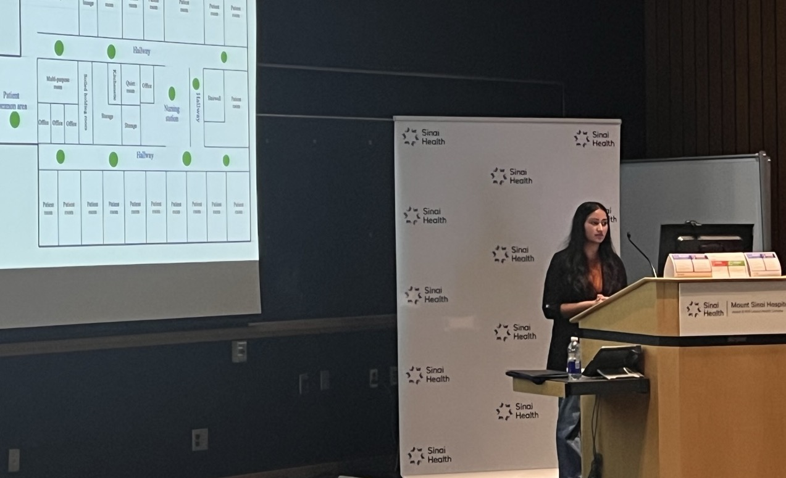
```

CUBE researcher Prachi Ray (M.Sc. candidate) brought home the 🏆 Top Abstract Award (Innovation Track) 🏆 for her work "Environmental surveillance for SARS-CoV-2 for outbreak detection in hospital: A single centre prospective study". Congratulations Prachi! 


-----

### IDWeek 2023 Conference

*[October 10<sup>th</sup>-14<sup>th</sup>, 2023. Boston, Mass.](https://idweek.org/)*

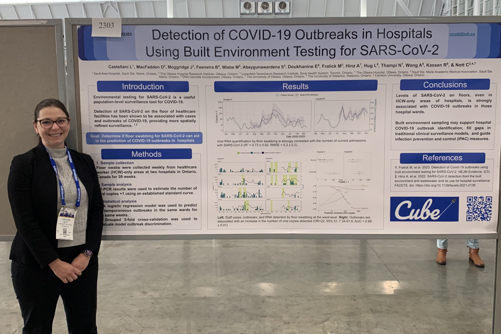

<br/>

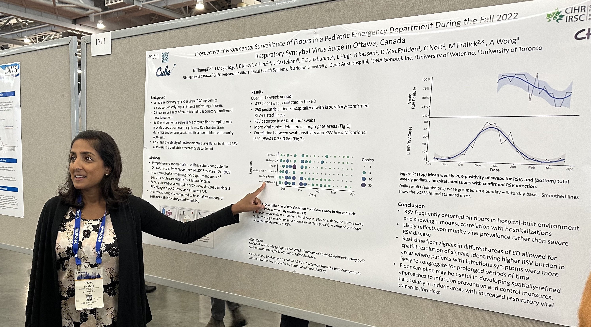

<br/>

----


### CoVaRR-Net Spring 2023 Meeting 

*May 16<sup>th</sup>-18<sup>th</sup>, 2023. Ottawa, ON.*

<br/>

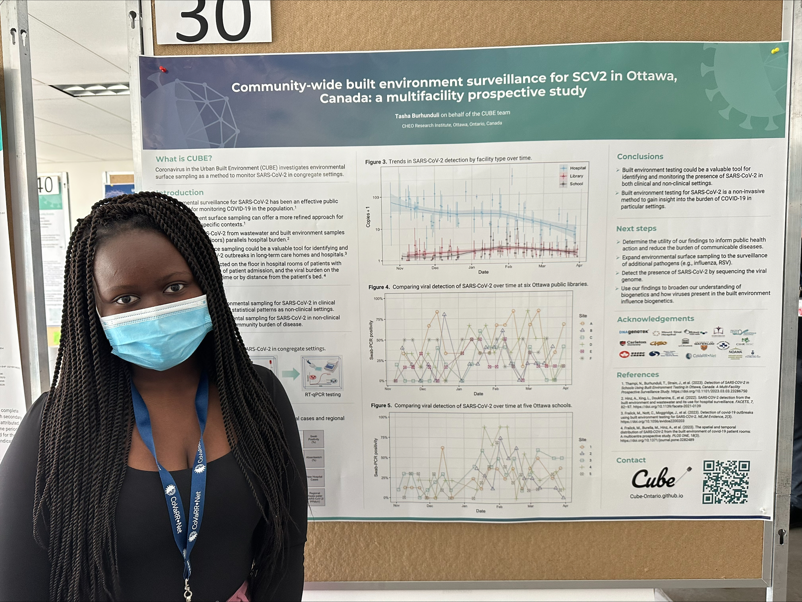

<br/>

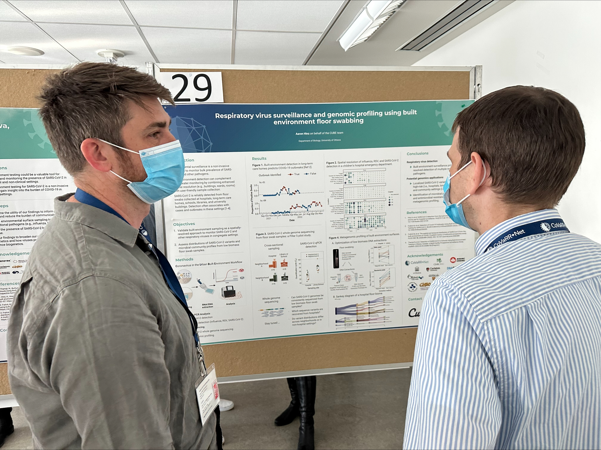

<br/>

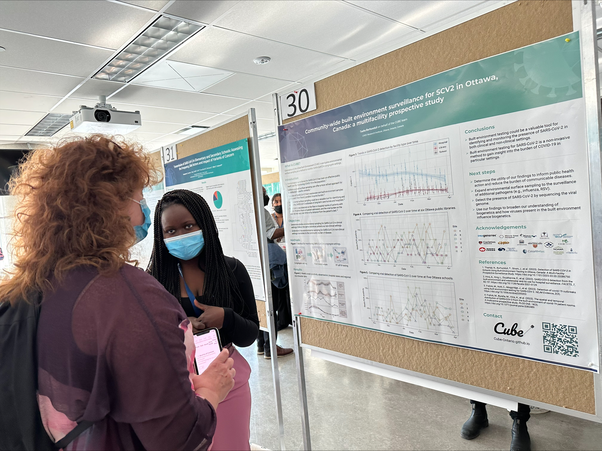

<br/>

------------------------------------
