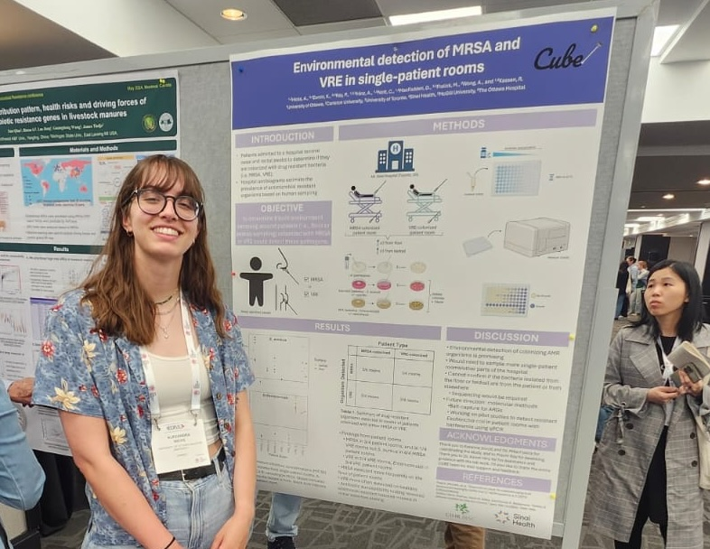
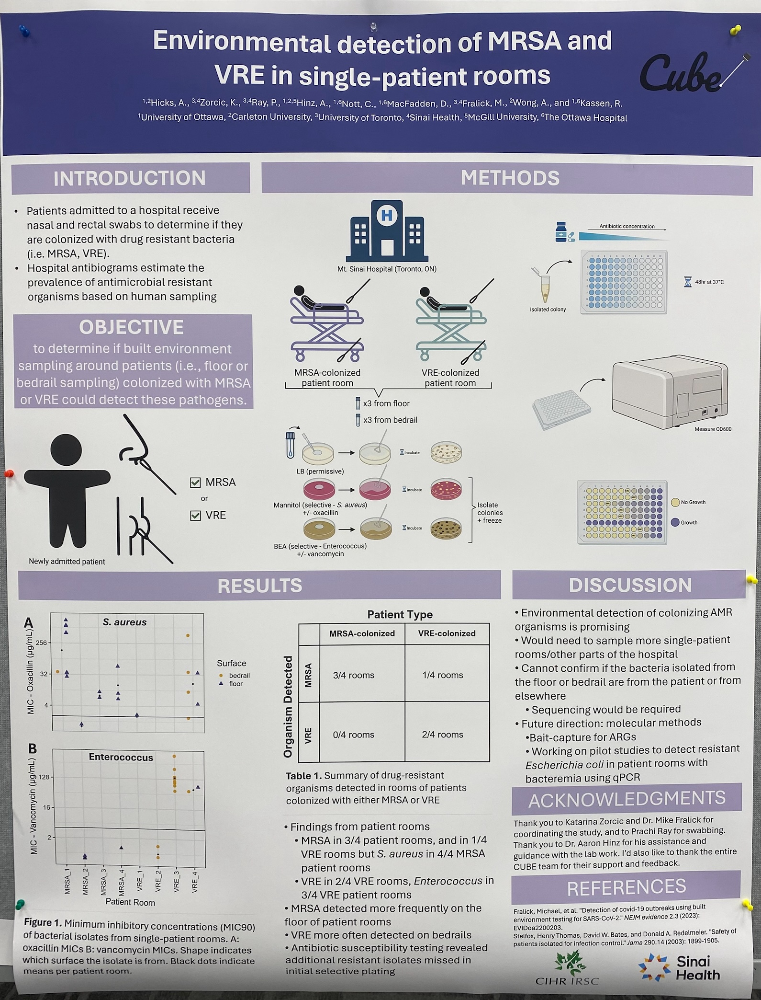
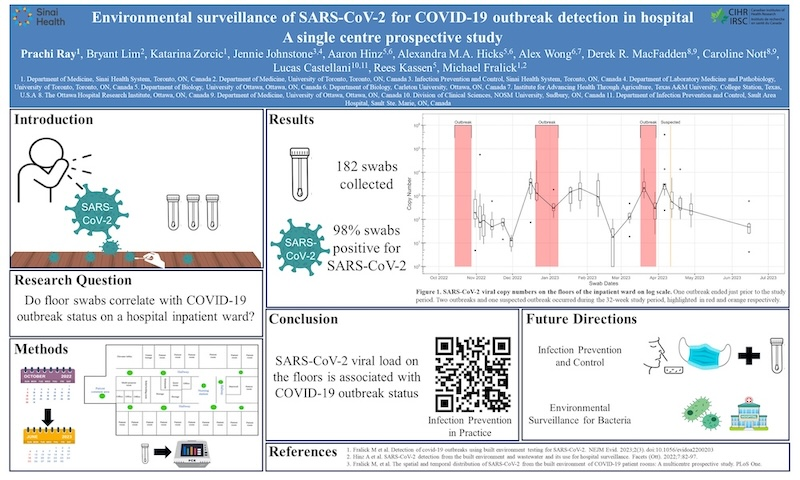

----

### EDAR7 Conference 2024

*May 26<sup>th</sup>-31<sup>st</sup>, 2024. McGill University, Montreal, QC.*

Alex Hicks presenting her poster "Environmental Detection of MRSA and VRE in Single-Patient Rooms" at the Environmental Dimension of Antimicrobial Resistance (EDAR7) conference.

```{r, out.width = "650px", echo=FALSE, fig.align='center'}

```

```{r, out.width = "650px", echo=FALSE, fig.align='center'}

```


----

### GIM Research Day 2024

*April 17<sup>th</sup>, 2024. University of Toronto, Division of General Internal Medicine*

CUBE researcher Prachi Ray presented her poster "Environmental surveillance of SARS-CoV-2 for COVID-19 outbreak detection in hospital: A single centre prospective study".

<div style="margin: auto; width: 100%;">
[](public/img/event/msh_poster_large.jpg)  
*Click image to enlarge*
</div>
-----

### Sinai Health Quality and Safety Symposium

*October 18<sup>th</sup>, 2023. Toronto, ON.*


```{r, out.width = "650px", echo=FALSE, fig.align='center'}

```

CUBE researcher Prachi Ray (M.Sc. candidate) brought home the 🏆 Top Abstract Award (Innovation Track) 🏆 for her work "Environmental surveillance for SARS-CoV-2 for outbreak detection in hospital: A single centre prospective study". Congratulations Prachi! 


-----

### IDWeek 2023 Conference

*[October 10<sup>th</sup>-14<sup>th</sup>, 2023. Boston, Mass.](https://idweek.org/)*


<br/>


<br/>

----


### CoVaRR-Net Spring 2023 Meeting 

*May 16<sup>th</sup>-18<sup>th</sup>, 2023. Ottawa, ON.*

<br/>


<br/>


<br/>


<br/>

------------------------------------
