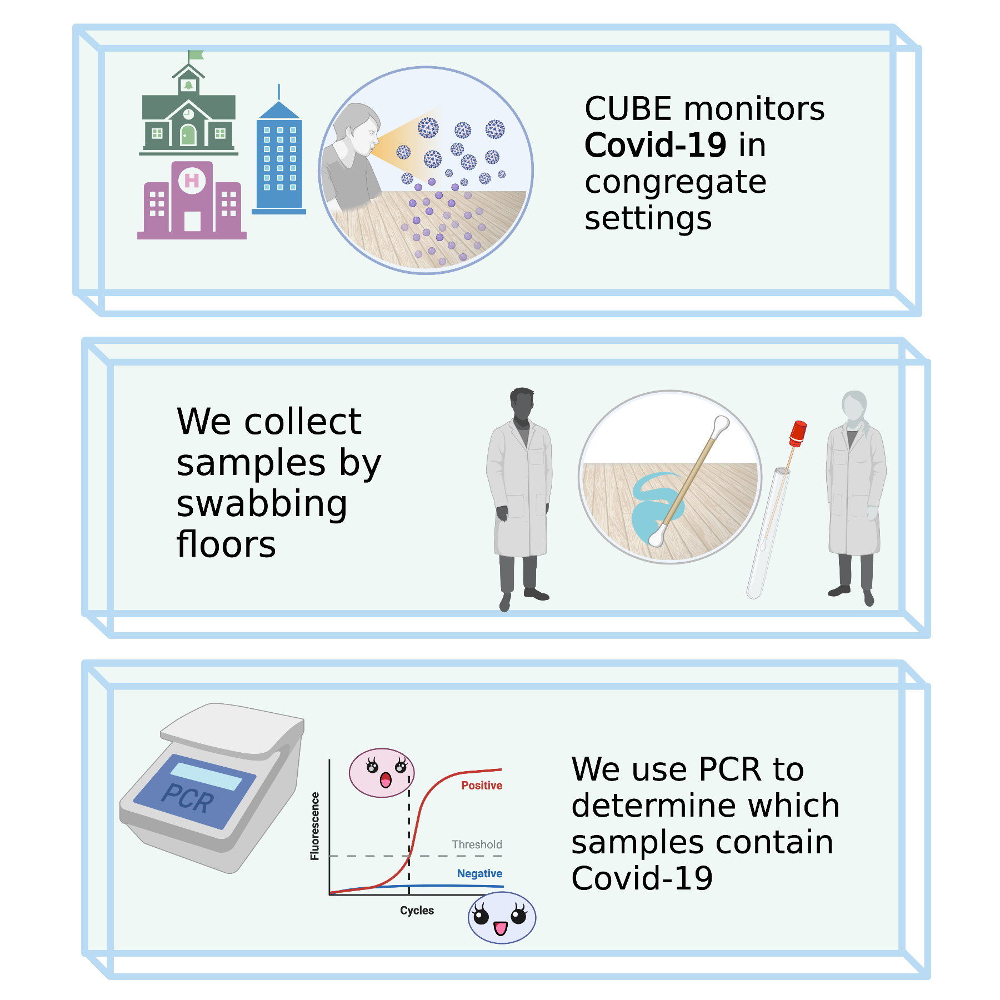

---

## About CUBE

<!-- *--infographic here--* -->

The CUBE (Covid-19 in the Built Urban Environment) project seeks to develop and apply environmental sampling as a spatially-resolved method for monitoring Covid-19 in congregate settings including long-term care homes (LTC), universities, and public schools. Currently, we are focused on facilities located in Toronto, Ottawa, and Sault Ste. Marie.

We swab floors and test for Covid-19 using an [RT-qPCR](https://en.wikipedia.org/wiki/Reverse_transcription_polymerase_chain_reaction) assay developed by [DNA Genotek](https://www.dnagenotek.com/) and a novel CRISPR-based device.

[Click here to read our preprint](https://www.medrxiv.org/content/10.1101/2021.04.09.21255159v2) from an earlier proof-of-principle study.

----

## FAQ

 

<h4 style="color:DodgerBlue";> Can we tell if the virus is viable or not?</h4>

Our assay is not able to discern whether Covid-19 recovered in floor samples is viable or not. 

 

<h4 style="color:DodgerBlue";> What can environmental sampling tell us about the Covid-19 burden in congregate settings?</h4>

Detection of Covid-19 in floor samples is correlated with the presence of infected persons.... 

 

----

## CUBE & Your Facility

To arrange for CUBE testing in your facility, please contact us by email: **email contact**

----

## Contribute to CUBE

To contribute to the CUBE project ... ?

Contributions would help us pay for swabs and reagents, allowing us to increase the number of locations included in our study... ?

----

## CUBE Team 

 
<!-- *--Pics & short bios here--* -->

  

   
    Jason Moggridge, M. Binf. 
     
    Research assistant at Lunenfeld-Tanenbaum Research Institute.  
    Data analyst and R programmer for CUBE.
  

 

 

  

     
     Homer Simpson
     Safety inspector for sector 7G at the Springfield nuclear power plant
  

 

  

     
     Bart Simpson
     
    Student at Springfield Elementary. Aye carumba!
  

-----

