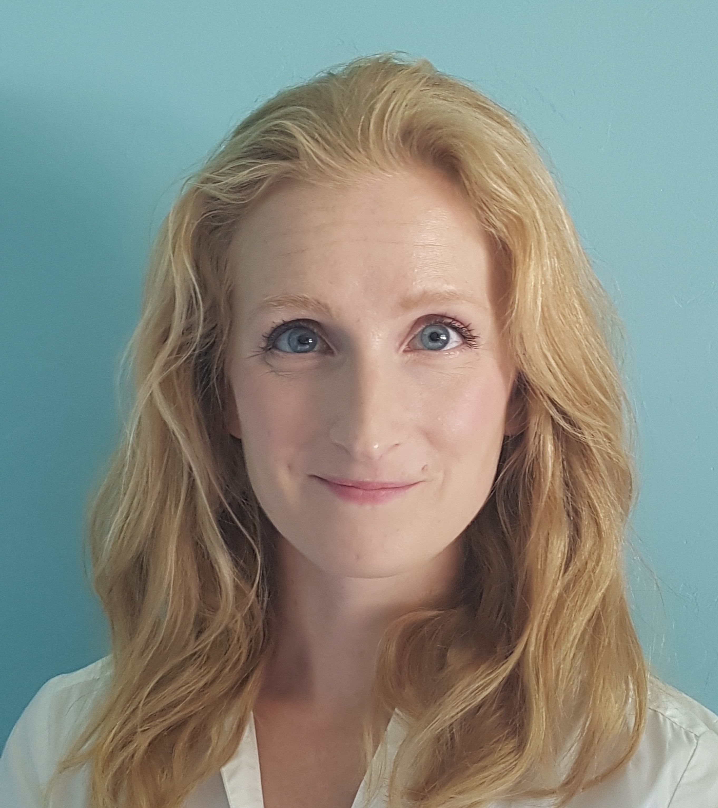

<!-- Doug Manuel and Allison McGeer -->

---

<!-- ## About CUBE section-->
<div class='row' style="margin-left:0%;margin-right:0%">

<!-- *--infographic here--* -->

</div>

<div>
<!-- header -->
<h2> About the CUBE study</h2>

<!-- blurb -->
The Covid-19 in the Urban Built Environment (CUBE) project seeks to develop environmental sampling as a spatially-resolved method for monitoring Covid-19 in congregate settings such as long-term care homes (LTC), universities, public schools, and daycares. 

We collect samples by swabbing floors; then, the swabs are tested for Covid-19 using an [RT-qPCR](https://en.wikipedia.org/wiki/Reverse_transcription_polymerase_chain_reaction) assay developed by [DNA Genotek](https://www.dnagenotek.com/) and/or a novel CRISPR-based device.

Currently, we are focused on facilities located in Toronto, Ottawa, and Sault Ste. Marie.

[Click here to read our preprint](https://www.medrxiv.org/content/10.1101/2021.04.09.21255159v2) from an earlier study showing the effectiveness of environmental sampling for Covid-19 monitoring.

</div>

<hr>

<!-- Section2 FAQs -->
<h2>Frequently Asked Questions</h2>

<!-- Accordion section with FAQs -->
<!-- Example: -->
<!-- <button class="accordion">Question X</button> -->
<!-- <div class="panel"> -->
<!--   <p>Answer X .......  </p> -->
<!-- </div> -->


<div>

<button class="accordion">
  <h4 class="faq">Why do you swab the floors?</h4>
</button>
<div class="panel">
  <p class="faqans">We swab floors to pick up any SARS-CoV-2 RNA (the genetic material of the virus) that we can then detect using laboratory-based genetic methods. The aim of our study is to develop this technique as a means to monitor the presence of SARS-CoV-2 in congregate settings (*e.g.* schools, daycares, long-term care homes, workplaces, etc.).<p/>
</div>

<button class="accordion">
  <h4 class="faq">How long will you be swabbing our facilities?</h4>
</button>
<div class="panel">
  <p class="faqans">Most facilities are swabbed on a weekly basis for a number of months.</p>
</div>

<button class="accordion">
  <h4 class="faq"> When will we hear about the results? </h4>
</button>
<div class="panel">
  <p class="faqans">The results will be made publicly available when the study is complete.</p>
</div>

<button class="accordion">
  <h4 class="faq">Can you get COVID-19 from the floor? Do we need to clean our floors more often?</h4>  
</button>
<div class="panel">
  <p class="faqans">The current scientific consensus is that Covid-19 is mainly transmitted through aerosols. It is __highly unlikely__ for an individual to become infected by Covid-19 directly from floors, but floors may have some viable virus present.</p>
</div>

<button class="accordion">
  <h4 class="faq"> What institutions are you affiliated with?</h4>
</button>
<div class="panel">
  <p class="faqans">Our research team has members affliated with The Ottawa Hospital, Children's Hospital of Eastern Ontario, Mt. Sinai Hospital, University of Ottawa, Carleton University, University of Toronto, University of Waterloo, and DNA Genotek.</p>
</div>

<button class="accordion">
  <h4 class="faq"> Who is funding the study? </h4>
</button>
<div class="panel">
  <p class="faqans">The CUBE study has received funding from NSERC, The Ottawa Hospital Academic Medical Organization (TOHAMO), University of Ottawa, Carleton University, and DNA Genotek.</p>
</div>

</div>


<!-- this javascript is needed to observe click/hover events for highlighting and expanding the accordion sections -->
<script>
var acc = document.getElementsByClassName("accordion");
var i;

for (i = 0; i < acc.length; i++) {
  acc[i].addEventListener("click", function() {
    <!-- Toggle between adding and removing the "active" class, -->
    <!-- to highlight the button that controls the panel  -->
    this.classList.toggle("active");
    <!-- Toggle between hiding and showing the active panel  -->
    var panel = this.nextElementSibling;
    if (panel.style.display === "none") {
      panel.style.display = "block";
    } else {
      panel.style.display = "none";
    }
  });
}
</script>

<div></div>
<hr>


<!-- SITES MAP SECTION -->
<h2>Site Locations</h2>
<p>These interactive maps show sites that are currently being monitored by our research team in Toronto and Ottawa.</p>


```{r maps, message=F, warning=FALSE, echo=F, fig.height=3, fig.width=3}
library(leaflet)
library(tidyverse)
# read site geo data and set marker colors based on type of site
sites <- 
  read_tsv(file = 'data/sites.tsv') |> 
  mutate(
    color = case_when(
      type == 'LTC' ~ 'cadetblue',
      type == 'University' ~ 'purple',
      type == 'Daycare' ~ 'green',
      type == 'School' ~ 'orange',
      TRUE ~ 'red'
    ))
# Possible values are "red", "darkred", "lightred", "orange", "beige", "green",
# "darkgreen", "lightgreen", "blue", "darkblue", "lightblue", "purple",
# "darkpurple", "pink", "cadetblue", "white", "gray", "lightgray", "black"

# define Marker style
icons <- awesomeIcons(
  icon = 'cube',
  library = 'ion',
  iconColor = 'white',
  spin = F,
  markerColor = sites$color
)
# map for Toronto sites
zmlvl <- 10
toronto_map <- 
  leaflet::leaflet(width = '100%', height = 300, padding = '5px') |>
  setView(lng = -79.34, lat = 43.74, zoom = zmlvl)  |> 
  addProviderTiles(
    provider = providers$CartoDB.Positron,
    options = providerTileOptions(minZoom = zmlvl-1, maxZoom = zmlvl+2)
  ) |>
  addAwesomeMarkers(
    data = sites, lng = ~ lon, lat = ~ lat,
    icon = icons, popup = ~str_trim(type)
  )
# map for Ottawa sites
zmlvl <- 11
ottawa_map <-
  leaflet::leaflet(width = '100%', height = 300, padding = '5px') |>
  setView(lng = -75.67, lat = 45.40, zoom = zmlvl)  |> 
  addProviderTiles(
    provider = providers$CartoDB.Positron,
    options = providerTileOptions(minZoom = zmlvl-1, maxZoom = zmlvl+2)
  ) |>
  addAwesomeMarkers(
    data = sites,
    lng = ~ lon,
    lat = ~ lat,
    icon = icons,
    popup = ~type
  )

library(htmltools)
browsable(
  tagList(list(
    tags$div(
      style = 'width:50%;display:block;float:left;padding:2px;',
      toronto_map
    ),
    tags$div(
      style = 'width:50%;display:block;float:left;padding:2px;',
      ottawa_map
    )
  ))
)

email_icon <- icons::icon_style(icons::fontawesome("paper-plane", style = "solid"), fill = '#2469e0', hover = '#fff')
```

<!-- need this to start next section below the maps, not underneath them! -->
<br><br><br><br><br><br><br><br><br><br><br><br><br><br><hr>


<h2>CUBE @ Your Facility</h2>
To arrange for CUBE testing in your facility, 
[please contact us by email `r email_icon` ](mailto:CUBEstudy21@gmail.com?subject=[CUBE]%20facility%20recruitment).
<hr>

<h2>Contribute to CUBE</h2>
<p>
If you are interested in contributing to the CUBE research project, 
[please contact us by email `r email_icon` ](mailto:CUBEstudy21@gmail.com?subject=[CUBE]%20funding) .
</p>
<hr>

<h2>Research Team </h2>
<br>

<!-- Evgueni Doukhanine -->
<div class='row' style= "top: 0px; margin: 5px 0; p">
  <p>
   
    <h4>Evgueni Doukhanine</h4>
    Molecular biologist at DNA Genotek specializing in microbiome research and development of chemical reagents and collection devices to facilitate stabilization of primary samples.
  </p>
</div>


<!-- Michael Fralick -->
<div class='row' style= "top: 0px; margin: 5px 0; ">
  <p>
     
    <h4>Dr. Michael Fralick</h4>
    Mike is the Toronto Lead for CUBE, Assistant Professor at University of Toronto, Clinician Scientist at Sinai Health, and Locum general internist at The Sault Area Hospital. 
  </p>
</div>

<!-- Aaron Hinz -->
<div class='row' style= "top: 0px; margin: 5px 0; ">
  <p>
     
    <h4>Aaron Hinz</h4>
    Aaron is a Research Associate at the University of Ottawa with interests in genetics and molecular mechanisms of microbial adaptation. For the CUBE project, he has been optimizing methods for SARS-CoV-2 detection from built environment samples.
  </p>
</div>

<!-- Benazir Hodzic-Santor -->
<div class='row' style= "top: 0px; margin: 5px 0; ">
  <p>
     
    <h4>Benazir Hodzic-Santor</h4>
    Bena is a medical student at the University of Toronto and a research assistant in Dr. Fralick’s lab. She is currently assisting with on-site swabbing in the GTA.
  </p>
</div>

<!--Laura Hug  -->
<div class='row' style= "top: 0px; margin: 5px 0; ">
  <p>
     
    <h4>Dr. Laura Hug </h4>
    Assistant Professor and Canada Research Chair in Environmental Microbiology in the Department of Biology at the University of Waterloo. Dr. Hug's research uses a combination of multi-omics and classical microbiological techniques to examine microbial diversity and function in contaminated sites.
    <br>
  </p>
</div>

<!-- Rees Kassen -->
<div class='row' style= "top: 0px; margin: 5px 0; ">
  <p>
     
    <h4>Dr. Rees Kassen</h4>
    <p>Full Professor and Cystic Fibrosis Canada Researcher, University of Ottawa.
    Dr. Kassen uses microbes to study the evolution of biodiversity. Rees is also active at the interface between science, society, and policy, serving currently as Chair of the Science and Innovation Advisory Council at the Institute on Governance and a member of the World Economic Forum’s [Global Future Council on Scientific Collaboration](https://www.weforum.org/communities/gfc-on-scientific-collaboration). 
    </p>
  </p>
</div>

<!-- Dr. Derek MacFadden -->
<div class='row' style= "top: 0px; margin: 5px 0;">
  <p>
   
    <h4>Dr. Derek MacFadden</h4>
    Dr. MacFadden is a clinician scientist and epidemiologist at the Ottawa Hospital Research Institute.  
  </p>
</div>


<!-- Jason Moggridge -->
<div class='row' style= "top: 0px; margin: 5px 0;">
  <p>
   
    <h4>Jason Moggridge </h4>
    Research assistant for Dr. Michael Fralick. Jason is a data analyst and programmer for the CUBE study.
  </p>
</div>

<!-- Dr. Caroline Nott -->
<div class='row' style= "top: 0px; margin: 5px 0;">
  <p>
   
    <h4>Dr. Caroline Nott</h4>
    Infectious Diseases Physician and Director of the Antimicrobial Stewardship Program at The Ottawa Hospital (TOH). Dr. Nott has supported TOH Infection Prevention and Control and Occupational Health Departments as a COVID-19 Pandemic Support Lead since April 2020. 
  </p>
</div>

<!-- Ashley Raudanskis -->
<div class='row' style= "top: 0px; margin: 5px 0; ">
  <p>
    
    <h4>Ashley Raudanskis</h4>
    Project Manager for the CUBE study. Ashley recently graduated from the University of Guelph and is focused on pursuing a career in healthcare in the near future. 
  </p>
</div>

<!-- Nisha Thampi -->
<div class='row' style= "top: 0px; margin: 5px 0; ">
  <p>
    
    <h4>Dr. Nisha Thampi</h4>
    Medical director of the Infection Prevention and Control Program at CHEO, a pediatric health and research centre in Ottawa, and Associate Professor of Pediatrics at the University of Ottawa.
  </p>
</div>

<!-- Tamara Van Bakel -->
<div class='row' style= "top: 0px; margin: 5px 0; ">
  <p>
    
    <h4>Tamara Van Bakel</h4>
    Tamara is a Research Coordinator at Sinai Health System providing administrative support. 
  </p>
</div>

<!-- Alex Wong -->
<div class='row' style= "top: 0px; margin: 5px 0; ">
  <p>
    
    <h4>Dr. Alex Wong</h4>
    Alex Wong is an associate professor of biology at Carleton University. His lab is optimizing methods for detecting SARS-CoV-2 in the built environment.
  </p>
</div>

<!-- Veronica Zanichelli -->
<div class='row' style= "top: 0px; margin: 5px 0; ">
  <p>
     
    <h4>Veronica Zanichelli</h4>
    Clinical research coordinator for CUBE and other projects in the field of infectious diseases at the Ottawa Hospital Research Institute.
  </p>
</div>
<br>

</div>


-----

<!-- ###### Copyright © 2021 CUBE study team. All Rights Reserved. -->


<!-- use this line to prevent the floating TOC from adding tons of blank space to the bottom of the webpage -->
<div class="tocify-extend-page" data-unique="tocify-extend-page" style="height: 0;"></div>
